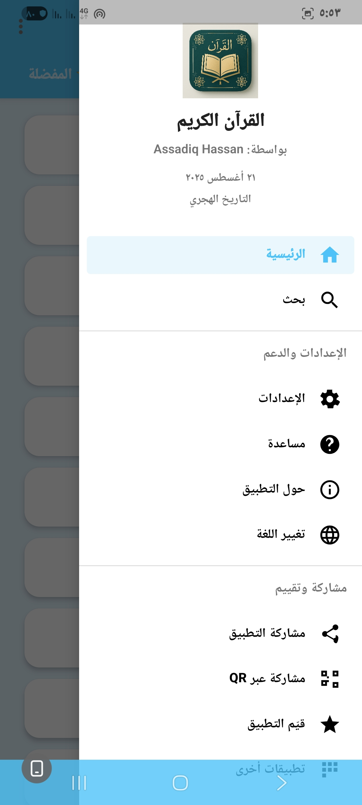
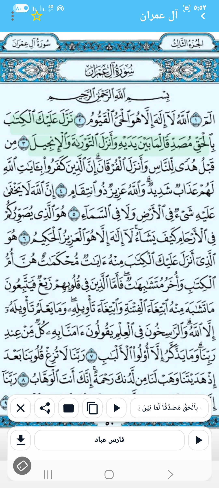
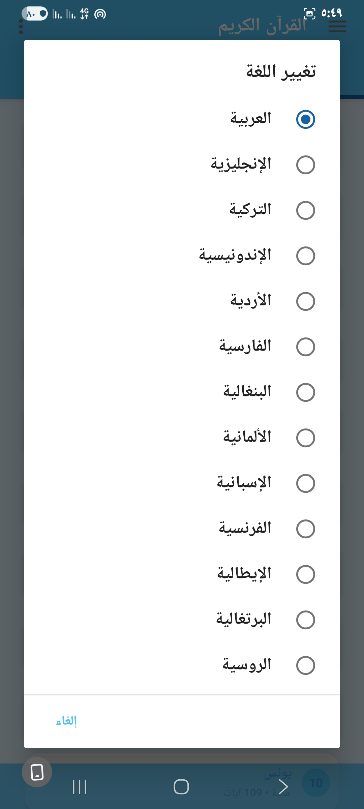
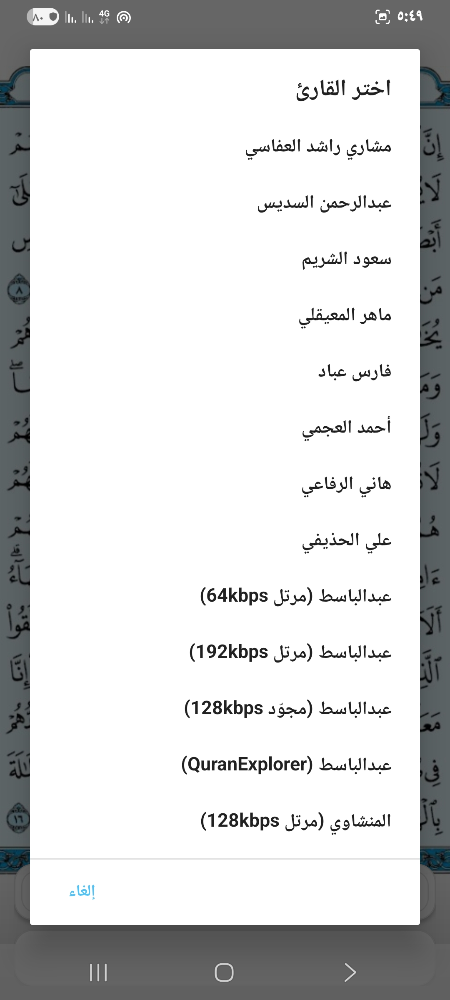

# 📖 تطبيق القرآن الكريم

تطبيق القرآن الكريم (Holy Quran) هو تطبيق مفتوح المصدر لعرض المصحف الشريف كاملًا مع العديد من الخصائص الحديثة.

---

## ✨ المميزات

- 📑 **عرض سور وأجزاء القرآن الكريم** بشكل منظم.  
- 🎧 **الاستماع للتلاوات** من عدة قرّاء (السديس، الشريم، المعيقلي، فارس عباد، العجمي، وغيرهم).  
- 🔄 **التكرار** مع إمكانية تحديد عدد مرات التكرار للآية.  
- 🌍 **تعدد اللغات** (العربية، الإنجليزية، التركية، الإندونيسية، الفارسية، الألمانية، الفرنسية، الإسبانية، الإيطالية، البرتغالية، الروسية...).  
- 📖 **التفسير**: عرض تفسير الآيات مع إمكانية المشاركة.  
- ⭐ **المفضلة**: حفظ الصفحات أو السور المفضلة للوصول السريع.  
- 🎨 **واجهة عصرية** مع دعم الوضع الليلي.  

---

## 📸 صور من التطبيق

### 🔹 الواجهة الرئيسية


### 🔹 قائمة السور


### 🔹 اختيار القارئ


### 🔹 اختيار اللغة


### 🔹 التفسير


### 🔹 إعدادات التكرار


### 🔹 حول التطبيق
.jpg)

### 🔹 صفحة الفاتحة
.jpg)

### 🔹 عرض آيات مع التظليل


---

## 📦 التنصيب والبناء

1. استنسخ المشروع:
   ```bash
   git clone https://github.com/assadig3/Holy-Quran.git
