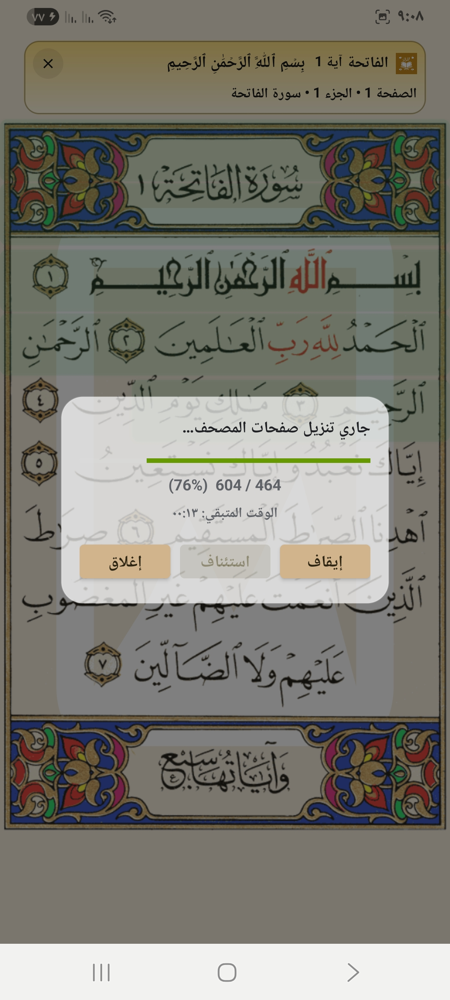
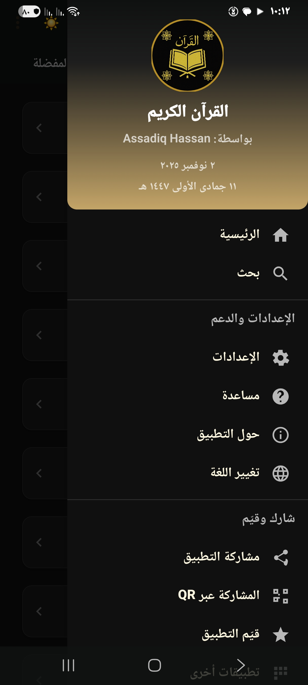
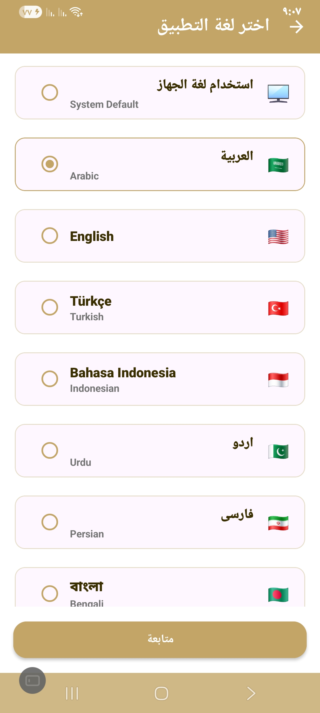
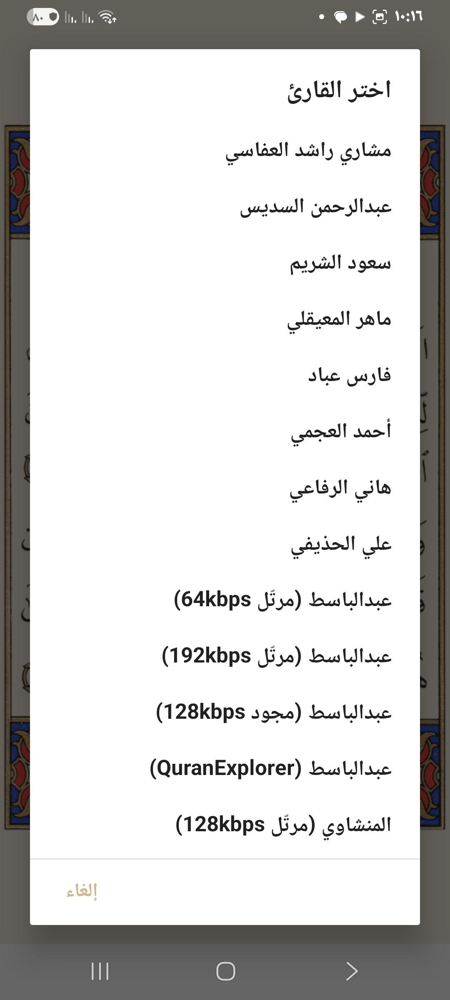
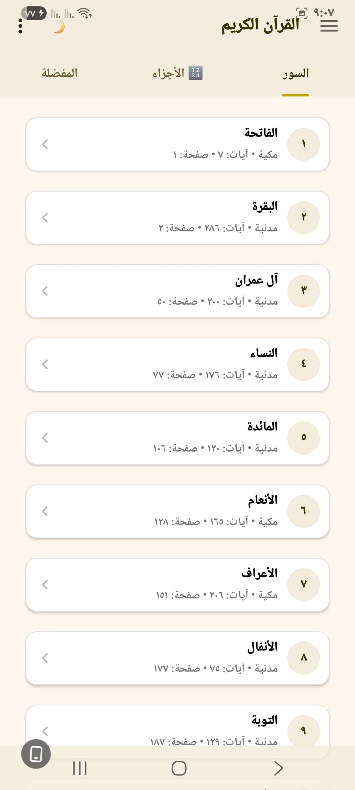
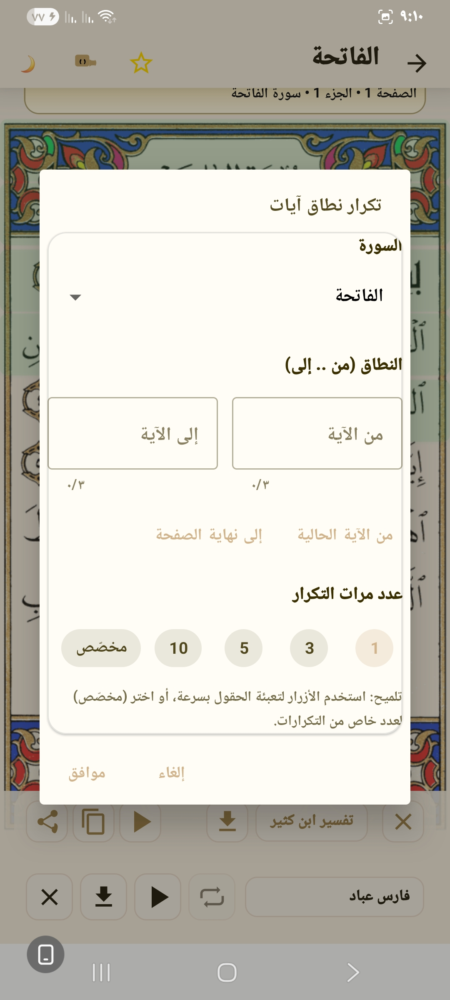

# 📖 تطبيق القرآن الكريم (Holy Quran)

تطبيق **القرآن الكريم** هو مصحف شامل يمنحك تجربة روحانية متكاملة تجمع بين التلاوة، الحفظ، والتدبر بواجهة أنيقة ودعم كامل للوضع الليلي.

---

## ✨ المميزات الرئيسية

### 📚 عرض المصحف العثماني
- عرض صفحات المصحف كاملة بجودة عالية جدًا.  
- دعم التكبير والتصغير وتدوير الشاشة.  
- تحميل الصفحات للتصفح بدون إنترنت مع مؤشر تقدّم ووقت متبقٍ.

### 🎧 تلاوة بأصوات كبار القراء
- تشغيل صوتي متزامن مع تظليل الآية الجارية.  
- أكثر من **35 قارئًا** مثل:
  - العفاسي، السديس، الشريم، المعيقلي، فارس عباد، عبد الباسط، المنشاوي، العجمي، الحذيفي، الرفاعي، وغيرهم.  
- خيارات جودة متعددة (64kbps / 128kbps / 192kbps).  

### 🔁 التحفيظ والتكرار
- تحديد سورة ونطاق آيات (من .. إلى).  
- اختيار عدد مرات التكرار (1، 3، 5، 10، مخصص).  
- مناسب للحفظ والمراجعة اليومية.  

### 📖 التفسير
- تفاسير متعددة مثل ابن كثير والجلالين.  
- عرض التفسير في نافذة منبثقة أنيقة مع خيارات نسخ ومشاركة.

### 🌙 الوضع الليلي والذهبي
- تصميم فاخر مريح للعين بألوان ذهبية.  
- التحويل التلقائي بين الوضعين النهاري والليلي.  

### 🌍 دعم 19 لغة عالمية
- من ضمنها: العربية، الإنجليزية، التركية، الإندونيسية، الأردية، الفارسية، البنغالية وغيرها.  
- شاشة اختيار لغة واضحة مع أعلام الدول.  

### ⭐ المفضلة وآخر الصفحات
- حفظ السور أو الصفحات كمفضلة.  
- استرجاع آخر 3 صفحات تمت زيارتها تلقائيًا.

### ⚙️ الإعدادات والقائمة الجانبية
- إعدادات عامة ودعم ومساعدة.  
- حول التطبيق مع التاريخ الهجري والميلادي.  
- مشاركة التطبيق عبر QR أو رابط مباشر.  
- تقييم التطبيق وروابط لتطبيقات المطور الأخرى.

---

## 📸 لقطات من التطبيق

> لقطات حقيقية من الإصدار **1.0.39** (الموجودة في مجلد `/screenshots` داخل المشروع)

### ⬇️ تحميل صفحات المصحف (استخدام بدون إنترنت)


### 📖 عرض صفحة من المصحف + شريط التلاوة


### 🌙 الوضع الليلي + القائمة الجانبية


### 📜 عرض الآيات مع التظليل أثناء التلاوة


### 📚 تبويب السور / الأجزاء / المفضلة


### 🕌 شاشة اختيار اللغة


### 🔁 إعدادات التكرار والتحفيظ


### 🎙️ اختيار القارئ


---

## ⚙️ كيفية بناء التطبيق

### باستخدام Android Studio:
1. افتح Android Studio.  
2. اختر: `File → Open` ثم مجلد المشروع.  
3. انتظر حتى يكتمل Gradle Sync.  
4. اختر التشغيل على جهاز أو محاكي Android.

### إنشاء ملف APK:
من Android Studio:  
> Build → Build Bundle(s) / APK(s) → Build APK(s)

أو من الطرفية:
```bash
./gradlew assembleRelease
